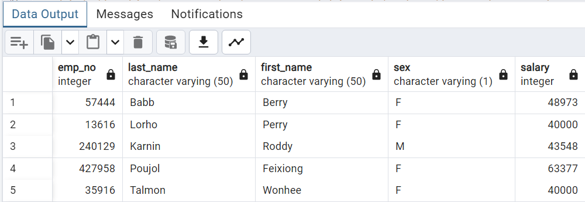
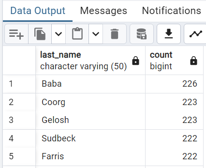

# Data-assignment-week9-sql-challenge

## Data modelling and engineering

The six CSV starter code files were inspected to create tables for each respective CSV file.

The type of data was also inspected to ensure the relevant data types were correctly allocated to each column and constraints were put on the data (not null, feasible value lengths etc.) to ensure the data parameters made it less likely for the data to be corrupt or unusable.

Once the six CSV files were inspected, tables were created in SQL.

I then determined what data should be classified as primary and foreign keys to be able to query the data for the Data Analysis step. After trial and error and discussing during my tutor session with Khangwelo. After our discussion I recreated the tables in the correct sequence to ensure the primary and foreign keys would be able to interact with each other.

I identified the 'employee' csv date columns for birth date and hire date had formatting issues. With inconsistent presentation of the data, this resulted in an error when importing the csv data into the SQL employee table. To overcome this code was written in 'employee_filter_code.ipynb' to convert the data to datetime format as it was originally stored as an object. I then exported this data into a new csv file called 'employees_python_final' and imported this csv data into the SQL employee table. This then worked and I could proceed with the challenge.

I uploaded my schema into QuickDBD to visually represent the relationships between the data as shown below.

## Data Analysis

The following results were obtained using the week9_sql_challenge_queries.sql and week9_sql_challenge_schema.sql files.

### 1. List the employee number, last name, first name, sex, and salary of each employee.

300,024 results were returned from the query

### 2. List the first name, last name, and hire date for the employees who were hired in 1986.

36,150 results were returned from the query

### 3. List the manager of each department along with their department number, department name, employee number, last name, and first name.

24 results were returned from the query 

### 4. List the department number for each employee along with that employee’s employee number, last name, first name, and department name.

331,603 results were returned from the query 

### 5. List the first name, last name, and sex of each employee whose first name is Hercules and whose last name begins with the letter B.

20 results were returned from the query 

### 6. List each employee in the Sales department, including their employee number, last name, and first name.

52,245 results were returned from the query 

### 7. List each employee in the Sales and Development departments, including their employee number, last name, first name, and department name.

137,952 results were returned from the query

### 8. List the frequency counts, in descending order, of all the employee last names (that is, how many employees share each last name).

1,638 results were returned from the query 

## References

Data-assignment-week9-sql-challenge, Tutor Session with Khangwelo, personal communication (Zoom), February 25, 2024

OpenAI. (2024). ChatGPT (GPT-3.5 architecture.) [Computer software]. Retrieved February 25, 2024, from https://openai.com/chatgpt

Quick Database Diagrams. (2024). Retrieved February 25, 2024, from https://www.quickdatabasediagrams.com/

University of Adelaide. (2024). 09-Ins_Joins. University of Adelaide VIRT-DATA-PT-12-2023-U-LOLC. https://git.bootcampcontent.com/University-of-Adelaide/UADEL-VIRT-DATA-PT-12-2023-U-LOLC/-/tree/main/09-SQL/1/Activities/09-Ins_Joins?ref_type=heads

University of Adelaide. (2024). 09-Ins_Joins. University of Adelaide VIRT-DATA-PT-12-2023-U-LOLC. https://git.bootcampcontent.com/University-of-Adelaide/UADEL-VIRT-DATA-PT-12-2023-U-LOLC/-/tree/main/09-SQL/1/Activities/10-Par_Joins?ref_type=heads

University of Adelaide. (2024). 04-Ins_Order_By. University of Adelaide VIRT-DATA-PT-12-2023-U-LOLC. https://git.bootcampcontent.com/University-of-Adelaide/UADEL-VIRT-DATA-PT-12-2023-U-LOLC/-/blob/main/09-SQL/2/Activities/04-Ins_Order_By/Solved/order_by_aggregates_solution.sql?ref_type=heads

University of Adelaide. (2024). 06-Ins_Subqueries. University of Adelaide VIRT-DATA-PT-12-2023-U-LOLC. https://git.bootcampcontent.com/University-of-Adelaide/UADEL-VIRT-DATA-PT-12-2023-U-LOLC/-/blob/main/09-SQL/2/Activities/06-Ins_Subqueries/Solved/subqueries_solution.sql?ref_type=heads

University of Adelaide. (2024). 07-Stu_Subqueries. University of Adelaide VIRT-DATA-PT-12-2023-U-LOLC. https://git.bootcampcontent.com/University-of-Adelaide/UADEL-VIRT-DATA-PT-12-2023-U-LOLC/-/blob/main/09-SQL/2/Activities/07-Stu_Subqueries/Solved/stu_subqueries_solution.sql?ref_type=heads

